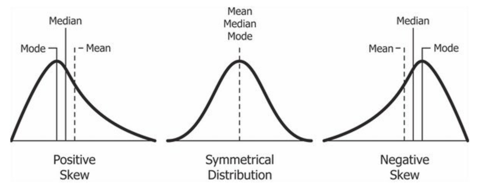

---
output:
  pdf_document: default
  html_document: default
---
# Summary Statistics {#summarystats}

Our first topic will be summary statistics and the basic question we want to ask is: given a list of numbers how can we describe its basic shape?

We will typically denote our list of numbers $x$ and refer to it as a **sample** or **dataset**. We can generate a particular example in R by doing the following. 

```{r}
x <- sample(0:50, 10, replace=TRUE)
print(x)
```

This will sample $10$ numbers "randomly" from the the integers between $0$ and $50$. Random can be a loaded term and we will talk more about what it can mean later, but here it means that each number is equally likely to be selected at each draw. The `replace=TRUE` bit means that we "put" a number back into the pot after we draw it so that we have the possibility of drawing it again. We will talk more about the various ways samples can be taken later on in the course.

## Frequency Histograms
We can visualize the list of numbers using a **histogram** as shown here. 
```{r}
hist(x, col="grey")
```

This is essentially a bar graph where the x-axis shows ranges and the y-axis gives the count of numbers in each range that appear in the sample. Or, said another way, the *height* of each bar is equal to the count of numbers in each range. This is called a **frequency histogram** because it displays the *number* of times each number appears on the list.

## How Large Are the Numbers on the List?

So, what do we really mean by the size of the numbers on the list? The right definition can often depend on what you are interested in. Maybe you only need to know the range of the numbers.

```{r}
max(x)
min(x)
```

These measure the extremes of the dataset, but how are the numbers distributed between them? Are they piled up on one side of the other? Do they mostly fall in the middle or are they evenly spread out? We can see the distrubution on a histogram, but how do we *quantify* these properties? We will do this with two numbers. One will measure where the "center" of the sample falls and the other measures how spread out the sample is. These are sometimes called *measures of central tendency*. Let's first discuss how we can describe the center of the dataset.

### The Median
The **median** of a list of numbers is the value at the midpoint if we were to arrange the numbers in order. This can also be thought of as a value separating the higher half from the lower half.
```{r}
sort(x)
median(x)
```
We can visualize the median on a frequency histogram.

```{r}
mx <- median(x)
hist(x, col='grey')
abline(v = mx, col = "blue", lwd = 4)
```

A nice property of the median is that it is not very sensitive to outliers, that is, numbers that are far from the center of the dataset.

```{r}
median(x)
```

Now watch what happens we add some very large numbers to the list.

```{r}
median(append(x, 939239))
median(append(x, 345254))
median(append(x, 76547567))
```

Notice that the median isn't very sensitive to the value of an added outlier. So, when data is known to have some kind of skew it is common to use medians to describe the center. A typical example of this is income due to its concentration in the hands of relatively few.

The median also has the property that if we were to randomly select a number from our list it would be just as likely be greater than the median as less. There is an interesting relationship between statistics and probability that we will discuss more in chapter \@ref(probability).

### The Average

Another way to define the center of a dataset is the average and in order to define it we will introduce a bit more notation. Recall that we are calling our list of numbers $x$. We could reference the individual numbers in the list by $x_i$ where $i$ can range between $1$ and $n$ where $n$ is the size of the list. The **average** or **mean** of the list $x$ can then be defined by the following expression. Note that we are following a fairly standard convention of denoting the average by the Greek letter "mu". Sometimes the mean is also denoted $\bar{x}$.

$$\mu(x) = \bar{x} = \frac{1}{n} \sum_{i=1}^n x_i$$
Here we are using [summation notation](https://en.wikipedia.org/wiki/Summation) which is convenient way of writing down a sum of an arbitrary number of terms. Let's look at an example to make sure we see how this notation works.

_**Example**_: Let $x = \{1, 6, 4, 7, 8\}$, then the average of $x$ is given by

$$\mu(x) = \frac{1}{5} \sum_{i=1}^5 x_i = \frac{1}{5} (1 + 6 + 4 + 7 + 8) = \frac{1}{5} (26) = 5.2$$

Of course, we could also let R do this for us.

```{r}
x <- c(1, 6, 4, 7, 8)
mean(x)
```

Now let's talk about some interpretations of the average. One is that it is the number that "balances" the histogram in the sense depicted in this image.


As we slide the rightmost part of the histogram out the average must move with it in order to prevent the histogram from tipping. Maybe this is why the average is sometimes called the **first moment** (see the definition of a [moment](https://simple.wikipedia.org/wiki/Moment_(physics)) from physics).

We can perform a similar experiment as we did with medians to look at how outliers affect the mean.

```{r}
mean(x)
mean(append(x, 939239))
mean(append(x, 345254))
mean(append(x, 76547567))
```

Unlike the median, the mean is very sensitive to outliers, but this isn't always a bad thing as we will see in a moment.

Another interpretation of the mean is that is the value for a "typical" number of the list. Or, more precisely, if we randomly select a number from the list the mean would be the best guess for what the value would be in the sense that it would, in the long run, be closer to the actually selected numbers than any other guess. We will talk more about this as well in chapter \@ref(probability). Notice that here we care about the outlier because we would, even if it was only occassionally, draw it from the list if we were to take enough draws.

To finish off this section we note that the relationship between the mean and median can give information about the shape of the histogram. Here is a nice graphic from the [wikipedia page](https://en.wikipedia.org/wiki/Skewness) on **skewness**. 
The third measure shown here is the **mode**. This is the value that occurs most often in the list, so it corresponds to the maximum value of the histogram.




### Root Mean Square

There is another measure of size that is important, but sometimes not given the attention it deserves. The expression below defines the **root mean square** of a list.

$$RMS(x) = \sqrt{\frac{1}{n}\sum_{i=1}^n x_i^2}$$

Why do we need another way of measure the size of the list? Consider the following example.

```{r, echo=FALSE}
x <- rnorm(1000)
hist(x, col='grey')
```

Notice that this histogram is fairly symmetric about $0$. This means that we should expect the mean to be close to $0$ (for example, by thinking about the balancing analogy above).

```{r}
mean(x)
```

Notice what happens when we add balanced outliers.

```{r}
hist(append(x, c(10, -10)), col='grey')
mean(x)
```

The mean is unchanged! This isn't good if we are interested in measuring the size of the *magnitude* of the numbers. This is where the root mean square comes in. It is sensitive to adding balanced outliers.

```{r}
sqrt(mean(x^2))
sqrt(mean(append(x, c(10, -10))^2))
```

It is reasonable to ask why we use this measure instead of something "simpler" like, for instance, taking the average of absolute values. In truth, that would also be a reasonable way to measure the size of the magnitudes of the numbers (average absolute deviation is a fairly common way to measure error). However, the root mean square is related to the notion of the norm of a vector in the **Euclidean space** $\mathbb{R}^n$ which, as we will see in chapter \@ref(corr), can be exploited. If this is unfamiliar, then the takeaway is that this formula fits into a larger framework and this is convenient.

## How Spread Out Are the Numbers?

Now that we know a few ways to describe the center of a list of numbers we can talk about measuring how the numbers are arranged around the center. Generally speaking we will use the mean as our definition of center.

### Standard Deviation

The **deviation** of a number on our list is defined as the difference between the number and the mean of the sample. The **standard deviation** is defined to be the root mean square of the deviations.

We can write the standard deviation formally as the following expression.

$$\sigma(x) = \sqrt{\frac{1}{n}\sum_{i-1}^n (x_i - \bar{x})^2}$$
Let's revisit the list we used in the mean example above, but this time compute the standard deviation. Recall that our list is $x = \{1, 6, 4, 7, 8\}$ and  the average of the list was $5.2$.

$$\sigma(x) = \sqrt{\frac{1}{5} \sum_{i=1}^5 (x_i - 5.2)^2} = $$ 
$$ = \sqrt{ \frac{1}{5} ((1 - 5.2)^2 + (6 - 5.2)^2 + (4 - 5.2)^2 + (7 - 5.2)^2 + (8 - 5.2)^2)} \approx 2.48 $$


We can also do this using R.

```{r}
x <- c(1, 6, 4, 7, 8)
deviations <- x - mean(x)
print(deviations)
```

Now that we have the deviations we can take the root mean square to obtain the standard deviation.

```{r}
sqrt(mean(deviations^2))
```

R does have a built in `sd` function. Let's give that a shot.


```{r}
sd(x)
```

This value is different because this function in R is actually what is typically called the **sample standard deviation**. What we defined above is technically called the **population standard deviation**. The sample standard deviation is given by the following.

$$S(x) = \sqrt{\frac{1}{n-1}\sum_{i-1}^n (x_i - \bar{x})^2}$$


The difference between the population and sample standard deviations is outside of our scope for now, but the fact that there are two notions of standard deviations is something to be aware of. We will go into more detail when we discuss probability in chapter \@ref(probability).

### Variance

The variance of a list of numbers is defined to be the square of the standard deviation and, as such, is typically denoted $\sigma^2$.

$$\sigma^2(x) = \frac{1}{n}\sum_{i-1}^n (x_i - \bar{x})^2$$

There are instances when working with a quantity that contains a square root is inconvenient and often using the variance can lead to simpler arithmetic, but it carries essentially the same information as the standard deviation.

## Density Histograms

As we previously mentioned, frequency histograms are essentialy just bar charts. This means that the scale of the y-axis depends on the numbers appear in our list. This can make it difficult to reason about the data or compare datasets to each other. For example, given the following histogram how could we quickly estimate the percentage of numbers that fall between $1$ and $2$?

```{r, echo=FALSE}
x <- rnorm(10000)
hist(x, col='grey')
```

We would need to sum up the heights of each bar between $1$ and $2$ and then divide by the size of the list. This isn't particularly difficult, but we can make this more easily read off the histogram. A **density histogram** is one where the the *area* of each bar corresponds to the *percentage* of numbers that fall within each range. If we restrict ourselves to histograms with bins of all the same width, then we can obtain the density histogram by dividing the frequency of each number by the sample size.

```{r, echo=FALSE}
hist(x, col='grey', freq = FALSE, main="Density Histogram of x")
```

To estimate the percentage of the numbers that fall between $1$ and $2$ we can estimate the total area of the bars between $1$ and $2$. Each bar has width $0.5$, so the area of the bar between $1$ and $1.5$ is about $0.5 * 0.2 = 0.1$ and the bar between $1.5$ and $2$ is has area about $0.5 * 0.1 = 0.05$. So, the percentage of the numbers that fall between $1$ and $2$ is about $15\%$.

Density histograms will play an important role in chapter \@ref(probability)  when we talk about the relationship between probability and statistics.

## Standardization

We can think of converting from a frequency histogram to a density histogram as a way of "standardizing" the data. In other words, we rescale so that the y-axes of all of our histograms have the same scale. It is often also convenient to rescale the data itself. We will give an example of why we might want to do this shortly, but first we will describe a typical way in which this is done.

Consider the following density histogram.

```{r, echo=FALSE}
x <- 10 * rnorm(10000)+113
hist(x, col='grey', freq = FALSE, main="")
```

To standardize this histogram we will make two modifications. The first will be to compute the mean of the data and then subtract that from each number in the sample. Let's do this using R and then look at the resulting histogram.

```{r}
x <- x - mean(x)
hist(x, col='grey', freq = FALSE, main="")
```

Notice that the histogram is now centered at $0$ instead of whatever the mean of the original dataset was. It can be nice to center histograms at $0$ if we are comparing the shape of data across datasets that may have different means (we will look at an example of this in the next section). It is interesting to note that the mean of the dataset after subtracting the original mean is $0$.

```{r}
mean(x)
```

Note that this number is in [scientific notation](https://en.wikipedia.org/wiki/Scientific_notation) and is very close to zero. It is not exactly zero due to rounding error in the numerical computation.

The second modification we will make is to divide each number in the sample by the standard deviation of the sample. Let's do this and then look at the effect on the histogram.

```{r}
x <- x / sd(x)
hist(x, col='grey', freq = FALSE, main="Standardized Histogram")
```

Notice that this standardized histogram has the same shape as the previous one, but it has been rescaled so that the majority of the values fall between $-2$ and $2$. 

We can interpret the rescaled data to be telling us how many standard deviations from the mean each datapoint in the original dataset falls. Sometimes these are called **standard units** and this is also related to the **z-statistic** that is used in hypothesis tests. But, this is a topic for chapter \@ref(hypothesis).

In the next section we will look at an example of how standardizing data can be a powerful tool for data analysis.

## Example

Consider the following situation motivated by a real situation within Mailchimp data. We have many users and each of their email campaigns have an associated open rate. Below we see density histograms for three different users showing the distributions of their open rates across all campaigns they have sent.

```{r, echo=FALSE}
x_1 <- rnorm(1000, mean=30, sd=2)
x_2 <- rnorm(1000, mean=20, sd=4)
x_3 <- rnorm(1000, mean=60, sd=10)

tblue <- rgb(0, 0, 255, max = 255, alpha = 50, names = "blue50")
tgreen <- rgb(0, 255, 0, max = 255, alpha = 50, names = "green50")
tred <- rgb(255, 0, 0, max = 255, alpha = 50, names = "red50")

h_1 <- hist(x_1, plot=FALSE)
h_2 <- hist(x_2, plot=FALSE)
h_3 <- hist(x_3, plot=FALSE)
```

```{r, echo=FALSE}
plot(h_1, col = tblue, freq=FALSE, xlim = c(0,100), xlab="Open Rate (%)", main="")
plot(h_2, col = tgreen, add=TRUE, freq=FALSE)
plot(h_3, col = tred, add=TRUE, freq=FALSE)
```

We can see from these histograms that the mean open rates for these users are about $20$, $30$, and $60$ respectively. We can also see that the variances around the means are different for each user. This makes sense since each user's audience will engage at different rates across campaigns.

Now suppose we want to analyze the impact of some Mailchimp feature on open rate. We could split each histogram by whether or not the campaigns used the feature.

```{r, echo=FALSE}
x_1_a <- rnorm(1000, mean=30-2, sd=2)
x_1_b <- rnorm(1000, mean=30+2, sd=2)
x_2_a <- rnorm(1000, mean=20-4, sd=4)
x_2_b <- rnorm(1000, mean=20+4, sd=4)
x_3_a <- rnorm(1000, mean=60-10, sd=10)
x_3_b <- rnorm(1000, mean=60+10, sd=10)

tblue_a <- rgb(0, 0, 150, max = 255, alpha = 50, names = "blue50_b")
tgreen_a <- rgb(0, 150, 0, max = 255, alpha = 50, names = "green50_b")
tred_a <- rgb(150, 0, 0, max = 255, alpha = 50, names = "red50_b")

h_1_a <- hist(x_1_a, plot=FALSE)
h_1_b <- hist(x_1_b, plot=FALSE)
h_2_a <- hist(x_2_a, plot=FALSE)
h_2_b <- hist(x_2_b, plot=FALSE)
h_3_a <- hist(x_3_a, plot=FALSE)
h_3_b <- hist(x_3_b, plot=FALSE)
```

```{r, echo=FALSE}
plot(h_1_a, col = tblue_a, freq=FALSE, xlim = c(0,100), xlab="Open Rate (%)", main="")
plot(h_1_b, col = tblue, add=TRUE, freq=FALSE)
plot(h_2_a, col = tgreen_a, add=TRUE, freq=FALSE)
plot(h_2_b, col = tgreen, add=TRUE, freq=FALSE)
plot(h_3_a, col = tred_a, add=TRUE, freq=FALSE)
plot(h_3_b, col = tred, add=TRUE, freq=FALSE)
```

Now we have two histograms for each of these users. One showing open rate using the feature and the other showing open rate *not* using the feature. It appears that there is a difference between open rates, but the actual amount of change seems to vary between the users. So, how can we quantify how much the feature impacts open rate?

An issue here is that it is difficult to separate the impact of the feature from the natural difference between audience engagement across these users. Let's try standardizing the histograms and see what happens.

We don't want to standardize using `sd(x_1_a)` and `mean(x_1_a)` because we would 

```{r, echo=FALSE}
x_1_a <- (x_1_a - mean(x_1)) / sd(x_1)
x_1_b <- (x_1_b - mean(x_1)) / sd(x_1)
x_2_a <- (x_2_a - mean(x_2)) / sd(x_2)
x_2_b <- (x_2_b - mean(x_2)) / sd(x_2)
x_3_a <- (x_3_a - mean(x_3)) / sd(x_3)
x_3_b <- (x_3_b - mean(x_3)) / sd(x_3)

h_1_a <- hist(x_1_a, plot=FALSE)
h_1_b <- hist(x_1_b, plot=FALSE)
h_2_a <- hist(x_2_a, plot=FALSE)
h_2_b <- hist(x_2_b, plot=FALSE)
h_3_a <- hist(x_3_a, plot=FALSE)
h_3_b <- hist(x_3_b, plot=FALSE)

plot(h_1_a, col = tblue_a, freq=FALSE, xlim = c(-5,5), xlab="Open Rate Standard Units", main="")
plot(h_1_b, col = tblue, add=TRUE, freq=FALSE)
plot(h_2_a, col = tgreen_a, add=TRUE, freq=FALSE)
plot(h_2_b, col = tgreen, add=TRUE, freq=FALSE)
plot(h_3_a, col = tred_a, add=TRUE, freq=FALSE)
plot(h_3_b, col = tred, add=TRUE, freq=FALSE)
```

After standardizing we can see that the histograms corresponding to using the feature have collapsed to almost the same histogram and similarly for the histograms corresponding to not using the feature. The peaks of the histograms corresponding to using the feature are at about $1$ standard unit and the peaks of the histograms corresponding to not using the feature are at about $-1$ standard unit. We can interpret this as telling us that that if a user uses the feature they should expect for the campaign to perform at about $1$ standard deviation above their mean open rate. Similarly, if a user does not use the feature then they should expect the campaign to perform at about $1$ standard deviation below their mean open rate. 

Note that the data used in this example was fake and generated so that these standardized histograms lined up well and the separation between using and not using the feature was large. Real data is generally much noisier than this and the effect of feature usage is much harder to tease out.

There is one more important thing to note about this example. In order to get an idea of the feature's impact we need to standardize in a slightly different way than was described above. We have split each users data into two groups, but we will standardize each group with respect to the overall mean and standard deviation of the user's campaign open rate data as show below. Note that `x_1_a` is the data from campaigns sent by this user that did not use the feature in question.

```{r}
standardized_data <- (x_1_a - mean(x_1)) / sd(x_1)
```

If we had instead standardized using the mean and standard deviation of `x_1_a` then we would have ended up with data that was mean $0$ and variance $1$ as we noted previously. So, all of the histograms would have piled on top of each other and we would have hidden the actual impact of the feature from ourselves as shown below. 

```{r, echo=FALSE}
x_1_a <- rnorm(1000, mean=30-2, sd=2)
x_1_b <- rnorm(1000, mean=30+2, sd=2)
x_2_a <- rnorm(1000, mean=20-4, sd=4)
x_2_b <- rnorm(1000, mean=20+4, sd=4)
x_3_a <- rnorm(1000, mean=60-10, sd=10)
x_3_b <- rnorm(1000, mean=60+10, sd=10)

tblue_a <- rgb(0, 0, 150, max = 255, alpha = 50, names = "blue50_b")
tgreen_a <- rgb(0, 150, 0, max = 255, alpha = 50, names = "green50_b")
tred_a <- rgb(150, 0, 0, max = 255, alpha = 50, names = "red50_b")

h_1_a <- hist(x_1_a, plot=FALSE)
h_1_b <- hist(x_1_b, plot=FALSE)
h_2_a <- hist(x_2_a, plot=FALSE)
h_2_b <- hist(x_2_b, plot=FALSE)
h_3_a <- hist(x_3_a, plot=FALSE)
h_3_b <- hist(x_3_b, plot=FALSE)

x_1_a <- rnorm(1000, mean=30-2, sd=2)
x_1_b <- rnorm(1000, mean=30+2, sd=2)
x_2_a <- rnorm(1000, mean=20-4, sd=4)
x_2_b <- rnorm(1000, mean=20+4, sd=4)
x_3_a <- rnorm(1000, mean=60-10, sd=10)
x_3_b <- rnorm(1000, mean=60+10, sd=10)

tblue_a <- rgb(0, 0, 150, max = 255, alpha = 50, names = "blue50_b")
tgreen_a <- rgb(0, 150, 0, max = 255, alpha = 50, names = "green50_b")
tred_a <- rgb(150, 0, 0, max = 255, alpha = 50, names = "red50_b")

x_1_a <- (x_1_a - mean(x_1_a)) / sd(x_1_a)
x_1_b <- (x_1_b - mean(x_1_b)) / sd(x_1_b)
x_2_a <- (x_2_a - mean(x_2_a)) / sd(x_2_a)
x_2_b <- (x_2_b - mean(x_2_b)) / sd(x_2_b)
x_3_a <- (x_3_a - mean(x_3_a)) / sd(x_3_a)
x_3_b <- (x_3_b - mean(x_3_b)) / sd(x_3_b)

h_1_a <- hist(x_1_a, plot=FALSE)
h_1_b <- hist(x_1_b, plot=FALSE)
h_2_a <- hist(x_2_a, plot=FALSE)
h_2_b <- hist(x_2_b, plot=FALSE)
h_3_a <- hist(x_3_a, plot=FALSE)
h_3_b <- hist(x_3_b, plot=FALSE)

plot(h_1_a, col = tblue_a, freq=FALSE, xlim = c(-5,5), xlab="Open Rate Standard Units", main="")
plot(h_1_b, col = tblue, add=TRUE, freq=FALSE)
plot(h_2_a, col = tgreen_a, add=TRUE, freq=FALSE)
plot(h_2_b, col = tgreen, add=TRUE, freq=FALSE)
plot(h_3_a, col = tred_a, add=TRUE, freq=FALSE)
plot(h_3_b, col = tred, add=TRUE, freq=FALSE)

```

## Lab Questions

### Introduction to R 

R is a high level statistical computing language. We will be using RStudio as an development environment for this course.  I am borrowing a lot from this great book on [R for Data Science](https://r4ds.had.co.nz/index.html) , this [overview ](https://github.com/CerebralMastication/r_for_the_student), as well as some stuff from this great [bayes analysis book](https://bookdown.org/content/3686/the-r-programming-language.html). 


Before we get started, let's make some appearance changes that will make the screen shots easier to see.


Whew, that's better. Now, let's get to know the development environment. First create a file, and then we step through the sections


We will walk through these one by one in the lab 


### Getting help

```{r, echo=F}
help.start()
```

shows many of the help documentation that is available. You can also get help with most any function with by prepending `?` to the funcion call. For instance, to get help with the sample() function in base R, 

```{r}
?sample()
```

And the documentation will show in the Help tab. 


### Running code 

You can run code three ways: 

1. Type code directly into the RELP (Read–eval–print loop)
```{r}
print("hello world")
```

2. Type code into the text editor, and hit Run (top left) (you can also run your current line by hitting cmd + enter, see [here](https://support.rstudio.com/hc/en-us/articles/200711853-Keyboard-Shortcuts) for more keyboard shortcuts).


3. Saving your code and calling the saved code from the command line. 

### Tutorial : Quick overview 

On the command line run the following command: 

`learnr::run_tutorial("R_Basics", "sur")`

and follow the prompts. 


### Functions 

Functions allow you make code repeatable and callable. We will be learning more about functions in later 
```{r}
print_str = function(str){
print(str)
}

print_str("hello, world")
```


The inputs to the function can be given a default. 

```{r}
print_str = function(str="intial string"){
print(str)
}

print_str()
```

 if you pass an argument, it will override the default
 
```{r}
print_str = function(str="intial string"){
print(str)
}

print_str("something clever")
```


Typically functions are used to perform an actions, or series of actions.


```{r}
add_two_numbers = function(x,y){
  return(x + y)
}

add_two_numbers(1,2)

```


### Variable assignment and types

Variables can assigned with = operator and -> and <- operators (always remember that the arrow points to the variable, also the -> is not often used). 

```{r}
a1 = 10
a2 <- 10

a1
a2

```


This list is not exhaustive, but in general you will be working with five type of variables: 
1. strings
2. numeric 
3. dates
4. data.frame: rectangular data, think a spreadsheet
5. factors: categorical variables, distinct buckets like "big", "small"
6. lists: list are hierarchical holders of different data types 


### Packages

In R you can compile a series of functions and data into a package. Creating packages is outside the scope of this course, but if you want to get good at R, going through the process of creating packages is one the best routes. There are thousands of packages available that people have put together. For instance, `ggplot` is a common graphing package. To install a pacakge run `install.packages("ggplot")`. To load a package, run `library(ggplot)`. For instance,

```{r}
library(dplyr)
library(bigrquery)
library(DBI)
library(plotly)
library(gapminder)
```

these commands would load some commonly used packages for statisical computing, some bigquery  and SQL commands, and another plotting package. Notice that these packages will only load if you have installed them, but you will only need to install them once. 


### Loading data 

Let's create a csv to work on. First create an empty code file


Copy and paste, or type the following in the file: 

```
a,b,c
1,2,3
4,5,6
7,8,9
```


Save the file as `data.csv`, a prompt will ask you if *really* want to do that (change file type), say yes. Next, let's load that file into memory. Close the csv, and create another empty R file as above. In the new file type the following 
```
dat = read_csv("./data.csv")
```

Hit `Run` (or cmd + enter) and you will get some parsing information print to the screen, and a new element in memory called dat (because that is what you named it). To inspect it, click on the data element in the Environment tab 


### Tutorial 1: Data Basics 

On the command line run the following command: 

`learnr::run_tutorial("ex-data-basics", "learnr")`

and follow the prompts. 


#### Tidyverse Packages

(The following is borrowed from the R From Students mentioned above)


When a user installs the Tidyverse, 19 packages are installed . When the user loads the tidyverse using `library(tidyverse)` a core subset of 8 packages are loaded into R. To use any of the packages not loaded with the core Tidyverse, a user must explicitly load those packages (e.g. `library(readxl)`) or call the packages using the package name prefix (e.g. `readxl::read_xlsx()` to run the `read_xlsx()` function from the `readxl` package).

The packages listed below are in the "Core Tidyverse" and loaded with `library(tidyverse)`. 

***Core Tidyverse***

`ggplot2`: data visualization  
`dplyr`: data manipulation   
`tidyr`: data reshaping  
`readr`: data import  
`purrr`: functional programming   
`tibble`: tidy dataframes   
`stringr`: string manipulation   
`forcats`: factor use   

***Additional Tidyverse***

There are 11 additional Tidyverse packages that install, but do not automatically load. 

*Import*

`readxl`: reading Excel files  
`haven`: reading SPSS, Stata, and SAS data  
`jsonlite`: manipulating JSON   
`xml2`: reading xml   
`httr`: accessing web APIs  
`rvest`: web scraping  
`feather`: data sharing with Python and beyond  

*Wrangle*

`lubridate`: date manipulation   
`hms`: time-of-day manipulation

*Modeling* 

`modelr`: modeling pipelines  
`broom`: takes model results and makes them tidy

More info on each can be found at https://tidyverse.tidyverse.org.


### dplyr Verbs

Almost any time a student works with data, they will need to manipulate that data in some way. Below, we will introduce the main 6 `dplyr` verbs to help wrangle data to gain additional insight. These verbs, `select`, `filter`, `mutate`, `group_by`, `summarize`, `arrange` are explained in detail below. 

In order to motivate use of the aforementioned verbs, we will look to answer the following question: 

**What is the average GDP per country since 1980?**

#### Verb 1: select

To begin, we only need to work with certain columns. The relevant columns to this question are `country`, `year`, `pop`, and `gdpPercap`. We can make this selection using the `select` function. The first argument in the `select` function is the data we wish to select from. The subsequent arguments are the names of the columns from the data we will select. In the code below, we save our selected columns into a new `tibble` called `gapminder_selected`. We use a different name for the output data frame so as to not overwrite the original data frame object. 

```{r selected}
gapminder_selected = select(gapminder, country, year, pop, gdpPercap)
gapminder_selected 
```

Once we view the data, we see that we still have 1704 rows but only 4 columns. 


#### Verb 2: filter

To further answer our question, we need to filter our data down to the years of interest. We can achieve this goal using the `filter` function. Like the `select` function, the first argument in the `filter` function is the data and subsequent argument is the logical statement of which you wish to filter. In the code below, we filter our selected data and save our filtered data into a new tibble called `gapminder_filtered`.

```{r filtered}
gapminder_filtered = filter(gapminder_selected, year >= 1980)
gapminder_filtered
```

Once we view the data, we see that our data now consist of 852 rows. This represents the rows of data since 1980.

### Tutorial 2: filter 

On the command line run the following command: 

`learnr::run_tutorial("ex-data-filter", "learnr")`

and follow the prompts. 

#### Verb 3: mutate

The next step in answering our question is creating a column that contains the GDP. The `mutate` function creates new columns according to a specific function that we provide. To answer our question, we need to determine the GDP in each year. To find the GDP, we need to multiply the `gdpPercap` by the `pop`. Similar to the previous two verbs, the first argument in the `mutate` function is the data. Subsequent arguments are columns you wish to create with corresponding formulas. In the code below, we mutate our filtered data and save our mutated data into a new tibble called `gapminder_mutated`.

```{r mutated}
gapminder_mutated = mutate(gapminder_filtered, GDP = gdpPercap * pop)
gapminder_mutated
```

Once we view the data, we see the new column, `GDP`, has been added to the end of our tibble. 


### Tutorial 3: mutate 

On the command line run the following command: 

`learnr::run_tutorial("ex-data-mutate", "learnr")`

and follow the prompts. 


#### Verb 4: group_by

The next step will be to group our data by the field of interest. In this instance, since we want to know GDP by country, we need to group the data by country. A way to conceptualize this step is to think of placing each group of data into a specific room. In subsequent steps we will apply a function to each group (or room) of data. Just like the previous verbs, the first argument in the `group_by` function is the data. The following arguments are the columns you wish to group by. In the code below, we group our mutated data and save our grouped data into a new tibble called `gapminder_grouped`.

```{r grouped}
gapminder_grouped = group_by(gapminder_mutated, country) 
gapminder_grouped
```

Students will notice that there appears to be no change to the data. This is mostly true as we have simply told R that we would like to apply future functions to each group of data instead of to the entire tibble. The only difference in output is a note explaining what the data has been grouped into and the number of groups. In this case, it explains the data is grouped by `country` and that there are 142 groups. 

#### Verb 5: summarise

Next, in order to determine the average GDP by country, we need to apply a function to each group we have identified. Specifically, we will need to take the average GDP over each country. Since we have already grouped by country, we next need to apply the summarise function. Like the previous verbs, the first argument in the `summarise` function is the data. The following arguments are the function to apply to each group. In the code below, we summarise the grouped data and save the summarised data into a new tibble called `gapminder_summarised`.

```{r summarise}
gapminder_summarised = summarise(gapminder_grouped, AVG_GDP = mean(GDP))
gapminder_summarised
```

We now have an answer to our question. The tibble above shows the average GDP per country since 1980. 

### Tutorial 4: summarize 

On the command line run the following command: 

`learnr::run_tutorial("ex-data-summarise", "learnr")`

and follow the prompts. 


#### Verb 6: arrange

However, we can refine our result to provide more understanding. Currently, our data is sorted alphabetically by country. This does not provide much insight. We can use the `arrange` function to sort the data by average GDP; either ascending or descending. Like all other verbs, the first argument in the `arrange` function is the data. The following arguments are the one or more columns which you wish to sort by. In the code below, we arrange our summarised data and save our arranged data into a new tibble called `gapminder_arranged`.

```{r arranged}
gapminder_arragned = arrange(gapminder_summarised, AVG_GDP)
gapminder_arragned
```

We see, from the output above, the countries with the smallest average GDP since 1980. 

It may be more interesting, however, to sort the average GDP in descending order so we can learn which countries have the highest average GDP. To do this we simply place a - sign in front of `AVG_GDP` in the code above.

```{r arrangeddesc}
gapminder_arragned_descending = arrange(gapminder_summarised, -AVG_GDP)
gapminder_arragned_descending
```

#### Simplifying Code with the Pipe Operator: `%>%` 

After helping learners see how each function works we can introduce the pipe operator (`%>%`).  This helpful code chains together commands and passes the results of one function directly into the next function. This results in very logical data manipulation steps that are fairly easy to learn and makes the code easy to understand:

```{r pipechain}
gapminder_arragned_descending_chained =
  gapminder %>%
  select(country, year, pop, gdpPercap) %>%
  filter(year >= 1980) %>%
  mutate(GDP = gdpPercap * pop) %>%
  group_by(country) %>%
  summarise(AVG_GDP = mean(GDP)) %>%
  arrange(-AVG_GDP)
gapminder_arragned_descending_chained
```


### Lecture questions: 

1. Run the following R code many times and notice that the answer is always an integer.

```{r}
median(sample(-10:10,5))
```

Now run this snippet a few times and notice that sometimes the answer is an integer, but sometimes it's a half integer. Why is this?

```{r}
median(sample(-10:10,6))
```


```

2. Run an experiment to verify that fact that if we were to randomly select a number from our list it would be just as likely that the number be greater than the median as less than the median.

3. Show that a standardized dataset has mean $0$ and standard deviation $1$. You can either do this formally or by looking at some examples in R.
